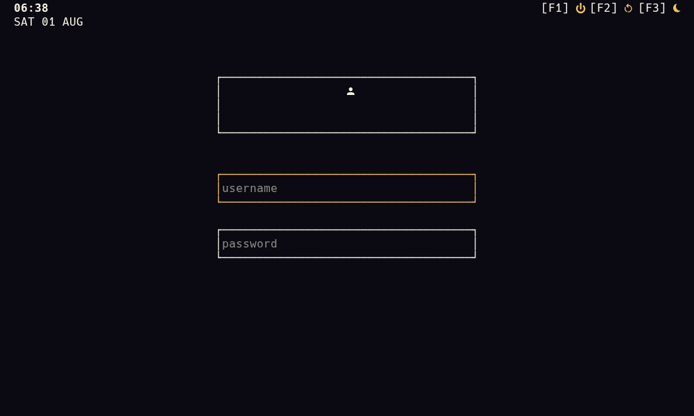

# grxxt

[](https://github.com/sxndmxn/grxxt/actions/workflows/ci.yml)
[](LICENSE)

A brutalist TUI greeter for [greetd](https://sr.ht/~kennylevinsen/greetd/).
It runs directly on a TTY: no display server or desktop shell required.



## Features

- Focused username/password login flow with clear error states
- Optional avatar with automatic terminal graphics detection and a half-block fallback
- Clock, date, and keyboard-driven shutdown, reboot, and suspend controls
- TOML configuration for the session command, avatar, and color theme
- The common single-secret PAM authentication flow

Additional visible or multi-secret authentication challenges are rejected cleanly; grxxt does not guess answers to PAM prompts.

## Install

Clone the repository and build the release binary:

```sh
git clone https://github.com/sxndmxn/grxxt.git
cd grxxt
cargo build --release --locked
./install.sh
```

Building requires Rust 1.90 or newer. The installer places the binary in `/usr/local/bin` and example configuration in `/etc/greetd`. Existing greetd configuration, including symlinks, is preserved.

Packagers can stage the same layout without `sudo` by setting an absolute destination root, for example `DESTDIR=/tmp/grxxt-stage ./install.sh`.

Then enable greetd:

```sh
sudo systemctl enable greetd
```

## Configuration

`/etc/greetd/grxxt.toml`:

```toml
session = "/usr/bin/Hyprland"
# avatar = "/path/to/avatar.png"

[theme]
background = "#0b0a13"
foreground = "#f6f1e3"
accent = "#f1c35f"
error = "#d14b64"
```

All fields are optional. grxxt reads `/etc/greetd/grxxt.toml`; a missing system config uses these defaults. For development, set an explicit path with `GRXXT_CONFIG=./grxxt.toml cargo run`. An explicitly selected missing file, unreadable files (including broken symlinks), malformed TOML, unknown fields, and invalid theme colors are reported instead of being ignored. Configuration files are limited to 64 KiB, with a 16 KiB limit on the session command.

Avatar images are optional and never block login. They must resolve to regular files. PNG and JPEG sources are limited to 64 MiB on disk, 4096×4096 pixels, and 64 MiB of decoder memory, then resized for terminal rendering.

Configure greetd to start grxxt as its greeter:

```toml
[terminal]
vt = 1

[default_session]
command = "/usr/local/bin/grxxt"
user = "greeter"
```

Power controls call `systemctl`, so they require systemd and the appropriate policy permissions.

## Key bindings

| Key | Action |
|---|---|
| Tab / Shift+Tab | Switch fields |
| Enter | Move to the password field or submit |
| F1 | Shut down |
| F2 | Reboot |
| F3 | Suspend |
| Esc | Quit a debug build |

## Development

Run the release-quality checks before sending a change:

```sh
cargo fmt --all -- --check
cargo test --locked --all-targets --all-features
cargo clippy --locked --all-targets --all-features -- -D warnings
cargo package --locked
cargo build --release --locked
bash -n install.sh tests/install.bash
bash tests/install.bash
cargo audit --deny warnings
cargo deny --locked --all-features check bans licenses sources
```

CI also verifies that every target and feature builds on the minimum supported Rust version and rejects unapproved dependency licenses or sources.
The final two local commands require the `cargo-audit` and `cargo-deny` subcommands, respectively.

## License

[MIT](LICENSE)
